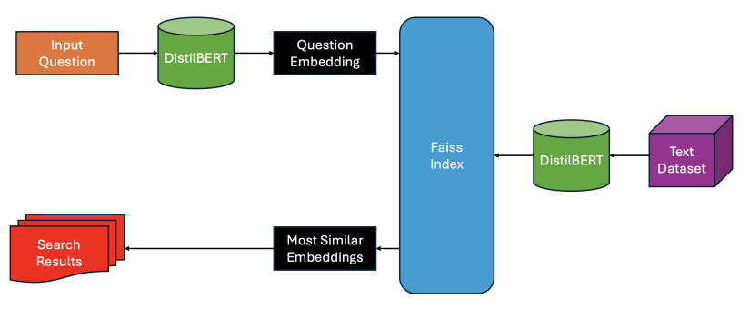
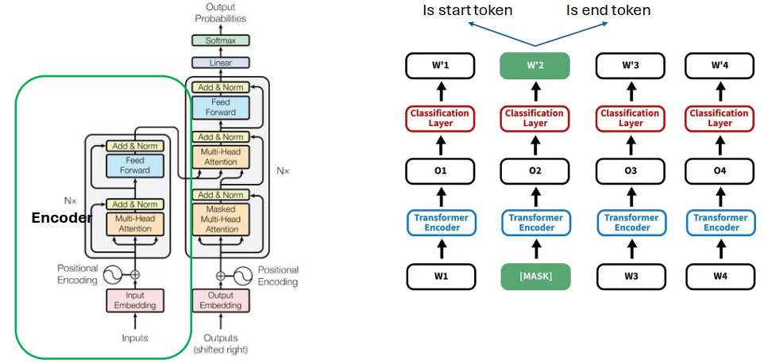

# Question Answering

## Datasets
- Open Domain: [Squadv2.0](https://huggingface.co/datasets/rajpurkar/squad_v2)
- Closed Domanin: [Python for Data Analysis](https://wesmckinney.com/book/)

## Pipelines and models
### Open Domain Question Answeing
| Search Pipeline | Extractive QA model |
| ----------- | ----------- |
|  |  |

- Reader: [qa-squadv2-distilbert](https://huggingface.co/hoannc0506/qa-squadv2-distilbert)
- Retriever: [distilbert-base-uncased](https://huggingface.co/distilbert/distilbert-base-uncased)
- Visualize data preprocessing: `DatasetVisualize.ipynb`
- Test Retriever: `Retriever.ipynb`
- Evaluate Reader: `Evaluate.ipynb`
- Train extractive reader:
    - Modify `config.py`
    - Run `python train_reader.py`
    - Example train log: [train_log](https://wandb.ai/hoannc6/Open-Domain-QA)

### Closed Domain Question Answering with RAG

- A basic RAG system with LlamaIndex to answer data analysis questions.
- Dataset: All book chapters from [Python for Data Analysis](https://wesmckinney.com/book/)
- Model: [Gemma-2B-it](https://huggingface.co/google/gemma-2b-it)
- Code and description: `RAG_LlamaIndex.ipynb`

## Referneces
1. [Question answering - HF course](https://huggingface.co/learn/nlp-course/chapter7/7?fw=pt)
2. [Prompt engineer guide - RAG](https://www.promptingguide.ai/techniques/rag)